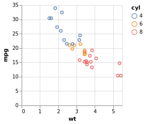

<!-- README.md is generated from README.Rmd. Please edit that file -->
<!-- badges: start -->

[](https://cran.r-project.org/package=vegawidget)
[](https://lifecycle.r-lib.org/articles/stages.html#maturing)
[](https://github.com/vegawidget/vegawidget/actions)
<!-- badges: end -->

# vegawidget

[Vega-Lite](https://vega.github.io/vega-lite/) is an implementation of
the grammar-of-graphics, rendered in the browser with interactivity.

The goal of vegawidget is to render Vega-Lite and Vega specifications as
htmlwidgets, and to help you communicate with a Vega chart using
JavaScript or Shiny. Its ambition is to be a *low-level* interface to
the Vega(-Lite) API, so that other packages can build upon it.

Accordingly, this package may be useful to:

-   build (using lists of lists) re-usable Vega and Vega-Lite
    specifications for deployment elsewhere.
-   develop higher-level, user-friendly packages to compose specific
    types of plots, or even to build a general ggplot2-like framework,
    using this package as the rendering foundation.

## Features

### New to vegawidget 0.4

-   vegawidget now supports the last two Vega-Lite major-versions,
    currently versions 5 and 4.

    However, for a given R session (e.g. rendering of an RMarkdown
    file), the `vegawidget()` function can use only *one* major-version;
    this version is determined using the `$schema` element of the first
    `vegaspec` evaluated using `vegawidget()`.

    This restriction does not apply to the image functions,
    e.g. `vw_to_svg()`, or to the compilation function, `vw_to_vega()`.

-   use `vega_version_all()` to see the available versions:

``` r
library("vegawidget")

vega_version_all()
#>   widget vega_lite   vega vega_embed
#> 1    vl5     5.2.0 5.21.0     6.20.2
#> 2    vl4    4.17.0 5.17.0     6.12.2
```

-   Compiling a spec and creating an image now uses the
    **[V8](https://cran.r-project.org/package=V8)** package, rather than
    depending on a local installation of nodejs.

## Installation

You can install vegawidget from CRAN with:

``` r
install.packages("vegawidget")
```

The development version of vegawidget is available from GitHub with:

``` r
# install.packages("devtools")
devtools::install_github("vegawidget/vegawidget")
```

**Note:** There are documentation websites for both the [CRAN
version](https://vegawidget.github.io/vegawidget/) and the [development
version](https://vegawidget.github.io/vegawidget/dev/) of this package.

## Introduction

Vega(-Lite) specifications are just text, formatted as JSON. However, in
R, we can use lists to build specifications:

``` r
library("vegawidget")

spec_mtcars <-
  list(
    `$schema` = vega_schema(), # specifies Vega-Lite
    description = "An mtcars example.",
    data = list(values = mtcars),
    mark = "point",
    encoding = list(
      x = list(field = "wt", type = "quantitative"),
      y = list(field = "mpg", type = "quantitative"),
      color = list(field = "cyl", type = "nominal")
    )
  ) %>% 
  as_vegaspec()
```

The `as_vegaspec()` function is used to turn the list into a *vegaspec*;
many of this package’s functions are built to support, and render,
vegaspecs:

``` r
spec_mtcars
```

<!-- -->

The rendering of the chart above depends on where you are reading it:

-   On this package’s [pkgdown
    site](https://vegawidget.github.io/vegawidget/), it is rendered as
    part of an HTML environment, showing its full capabilities.

-   At its [GitHub code site](https://github.com/vegawidget/vegawidget),
    the chart is further rendered to a static SVG file, then
    incorporated into the Markdown rendering.

A [learnr](https://rstudio.github.io/learnr/index.html) tutorial is
available: `learnr::run_tutorial("overview", package = "vegawidget")`.

For more, please see our [Getting
Started](https://vegawidget.github.io/vegawidget/articles/vegawidget.html)
article. Additionally, the [Vega-Lite
website](https://vega.github.io/vega-lite/) has a comprehensive
introduction.

Other articles for this package:

-   [Specify using
    vegaspec](https://vegawidget.github.io/vegawidget/articles/articles/vegaspec.html):
    how to construct and render a vegaspec.
-   [Render using
    vegawidget](https://vegawidget.github.io/vegawidget/articles/articles/render-vegawidget.html):
    advanced rendering options.
-   [Extend using
    Shiny](https://vegawidget.github.io/vegawidget/articles/articles/shiny.html):
    how to interact with Vega charts using Shiny.
-   [Extend using
    JavaScript](https://vegawidget.github.io/vegawidget/articles/articles/javascript.html):
    how to interact with Vega charts using JavaScript.
-   [Create
    Images](https://vegawidget.github.io/vegawidget/articles/articles/image.html):
    how to create and save PNG or SVG images.
-   [Work with Dates and
    Times](https://vegawidget.github.io/vegawidget/articles/articles/dates-times.html):
    dates and times in Vega(-Lite) work a little differently from R.
-   [Import into Other
    Packages](https://vegawidget.github.io/vegawidget/articles/articles/import.html):
    how to import vegawidget functions into your package, then re-export
    them.

## Acknowledgements

-   [Alicia Schep](https://github.com/AliciaSchep) has been instrumental
    in guiding the evolution of the API, and for introducing new
    features, particularly the JavaScript and Shiny functions.
-   [Haley Jeppson](https://github.com/haleyjeppson) and [Stuart
    Lee](https://github.com/sa-lee) have provided valuable feedback and
    contributions throughout the package’s development.
-   [Bob Rudis](https://github.com/hrbrmstr) and the
    [vegalite](https://github.com/hrbrmstr/vegalite) package provided a
    lot of the inspiration for this work, providing a high-level
    interface to Vega-Lite.
-   The [Altair](https://altair-viz.github.io) developers, for further
    popularizing the notion of using a programming language (Python) to
    create and render Vega-Lite specifications.  
-   The [Vega-Lite](https://vega.github.io/vega-lite/) developers, for
    providing a foundation upon which the rest of this is built.

## Contributing

Contributions are welcome, please see this
[guide](https://vegawidget.github.io/vegawidget/CONTRIBUTING.html).
Please note that this project is released with a [Contributor Code of
Conduct](https://vegawidget.github.io/vegawidget/CODE_OF_CONDUCT.html).
By participating in this project you agree to abide by its terms.
