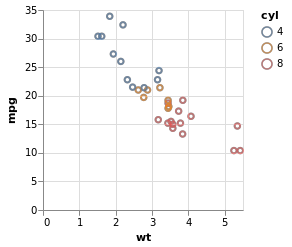

<!-- README.md is generated from README.Rmd. Please edit that file -->

[](https://www.tidyverse.org/lifecycle/#maturing)
[](https://travis-ci.org/vegawidget/vegawidget)
[](https://cran.r-project.org/package=vegawidget)

# vegawidget

The goal of vegawidget is to render Vega-Lite and Vega specifications as
htmlwidgets, and to provide you a means to communicate with a Vega chart
using JavaScript or Shiny. Its ambition is to be a *low-level* interface
to the Vega(-Lite) API, such that other packages can build upon it to
offer higher-level functions to compose Vega(-Lite) specifications.

This is the key difference with the
[**vegalite**](https://github.com/hrbrmstr/vegalite) package: it
provides a set of higher-level functions to compose specifications,
whereas **vegawidget** concerns itself mainly with the rendering of the
htmlwidget.

To be clear, although Vega-Lite offers a grammar-of-graphics, this
package does not offer a user-friendly framework to compose graphics,
like those provided by **[ggplot2](https://ggplot2.tidyverse.org)** or
**[ggvis](https://ggvis.rstudio.com)**. However, this package may be
useful to:

  - build re-usable Vega and Vega-Lite specifications for deployment
    elsewhere, if you can tolerate the frustration of building
    specifications using lists.
  - develop higher-level, user-friendly packages to build specific types
    of plots, or even to build a general ggplot2-like framework, using
    this package as a foundation (or inspiration).

## Installation

You can install vegawidget from CRAN with:

``` r
install.packages("vegawidget")
```

You can also install vegawidget from GitHub with:

``` r
# install.packages("devtools")
devtools::install_github("vegawidget/vegawidget")
```

This package supports these versions of Vega libraries:

``` r
library("vegawidget")
vega_version()
#> $vega_lite
#> [1] "2.6.0"
#> 
#> $vega
#> [1] "4.0.0"
#> 
#> $vega_embed
#> [1] "3.25.0"
```

The *first* released version of vegawidget supports Vega-Lite 2.6.0, the
*last* release of Vega-Lite that will run using JavaScript version ES5.
The next version of Vega-Lite, 3.0.0, will use JavaScript ES6.

In practical terms, this means that this version of vegawidget will be
the *only* version that will display properly using version 1.1.x of the
RStudio IDE.

As soon as Vega-Lite makes its 3.0.0 release, we will make another
vegawidget release - for which you will need to use a (presently
preview) version of the RStudio IDE at least 1.2.x.

## Introduction

For a comprehensive introduction to Vega-Lite, please visit the its [web
site](https://vega.github.io/vega-lite). An [interactive
tutorial](https://ijlyttle.shinyapps.io/vegawidget-overview) to
vegawidget is available at shinyapps.io.

Vega(-Lite) specifications are just text, formatted as JSON. However, in
R, we can use lists to build specifications:

``` r
spec_mtcars <-
  list(
    `$schema` = vega_schema(), # specifies Vega-Lite
    description = "An mtcars example.",
    data = list(values = mtcars),
    mark = "point",
    encoding = list(
      x = list(field = "wt", type = "quantitative"),
      y = list(field = "mpg", type = "quantitative"),
      color = list(field = "cyl", type = "nominal")
    )
  ) %>% 
  as_vegaspec()
```

The `as_vegaspec()` function is used to turn the list into a *vegaspec*;
many of this package’s functions are built to support, and render,
vegaspecs:

``` r
spec_mtcars
```

<!-- -->

The appearance of the chart above depends on where you are reading it:

  - On this package’s [pkgdown
    site](https://vegawidget.github.io/vegawidget), it is rendered as
    part of an HTML environment, showing its full capabilities.

  - At its [GitHub code site](https://github.com/vegawidget/vegawidget),
    the chart is further rendered as a static PNG.

This is package a low-level interface to Vega-Lite and the Vega
ecosystem, which has a lot of powerful capabilities, highlighted in this
series of articles:

  - [Specify using
    vegaspec](https://vegawidget.github.io/vegawidget/articles/vegaspec.html):
    how to construct and render a vegaspec.
  - [Render using
    vegawidget](https://vegawidget.github.io/vegawidget/articles/vegawidget.html):
    advanced rendering options.
  - [Extend using
    Shiny](https://vegawidget.github.io/vegawidget/articles/shiny.html):
    how to interact with Vega charts using Shiny.
  - [Extend using
    JavaScript](https://vegawidget.github.io/vegawidget/articles/javascript.html):
    how to interact with Vega charts using JavaScript.
  - [Create
    Images](https://vegawidget.github.io/vegawidget/articles/image.html):
    how to create and save PNG or SVG images.
  - [Work with Dates and
    Times](https://vegawidget.github.io/vegawidget/articles/dates-times.html):
    dates and times in Vega(-Lite) work a little differently from R.
  - [Import into Other
    Packages](https://vegawidget.github.io/vegawidget/articles/import.html):
    how to import vegawidget functions into your package, then re-export
    them.

To share your Vega(-Lite) creation on the [Blocks](https://bl.ocks.org)
website, you can use the
[**vegablock**](https://vegawidget.github.io/vegablock) package.

## Integration with other packages

Although there is an
[article](https://vegawidget.github.io/vegawidget/articles/import.html)
dedicated to this aspect of the package, it warrants further emphasis.

This package provides functions to render Vega(-Lite) specifications;
although it provides some helpers, it does not provide higher-level
functions to build specifications. Rather, this is left to other
packages. Even though you can use its functions directly, you are
invited to import and re-export them for use in *your* package.

Accordingly, this package offers a templating function,
`use_vegawidget()`, to help you integrate vegawidget functions into your
package. For example, it is used to import and re-export vegawidget
functions for the [altair](https://vegawidget.github.io/altair) package.

## Known limitations

The two biggest known limitations are both associated with vegaspecs
that contain [datasets specified using remote
URLs](https://vega.github.io/vega-lite/docs/data.html#url):

  - The RStudio IDE does not let you access remote URLs for security
    reasons. A chart that accesses remote data will not render in the
    IDE; it *will* render in a browser window.

  - The image functions use **nodejs** to create SVG strings. We are not
    able to configure the proxy in our node scripts, so if your computer
    uses a proxy to access remote data, our functions will not create
    the images properly.

## Acknowledgements

  - [Alicia Schep](https://github.com/AliciaSchep) has been instrumental
    in guiding the evolution of the API, and for introducing new
    features, particularly the JavaScript and Shiny functions.
  - [Haley Jeppson](https://github.com/haleyjeppson) and [Stuart
    Lee](https://github.com/sa-lee) have provided valuable feedback and
    contributions throughout the package’s development.
  - [Bob Rudis](https://github.com/hrbrmstr) and the
    [vegalite](https://github.com/hrbrmstr/vegalite) package provided a
    lot of the inspiration for this work, providing a high-level
    interface to Vega-Lite.
  - The [Altair](https://altair-viz.github.io) developers, for further
    popularizing the notion of using a programming language (Python) to
    create and render Vega-Lite specifications.  
  - The [Vega-Lite](https://vega.github.io/vega-lite/) developers, for
    providing a foundation upon which the rest of this is built.

## Contributing

Contributions are welcome, please see this [guide](CONTRIBUTING.md).
Please note that this project is released with a [Contributor Code of
Conduct](CODE_OF_CONDUCT.md). By participating in this project you agree
to abide by its terms.
