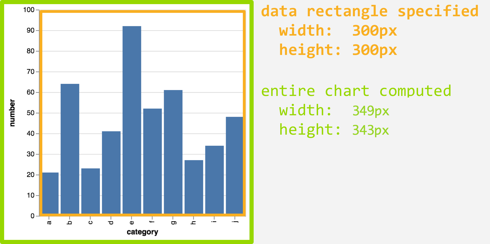
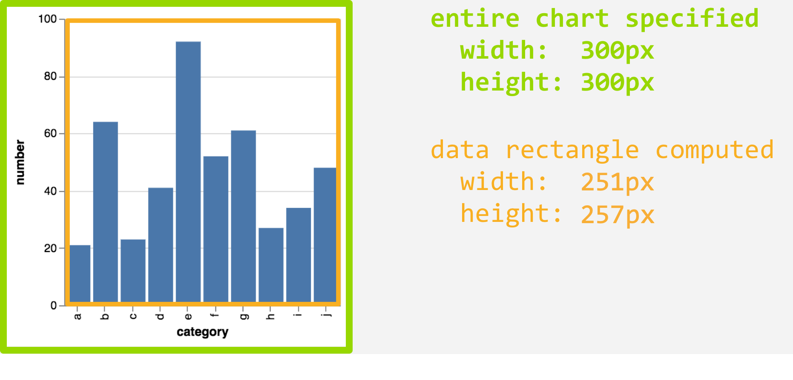

The central *object* of this package is a *vegaspec*, short for "Vega specification". This can refer to either a Vega or Vega-Lite specification; in our examples, we work almost exclusively with Vega-Lite.

This article will showcase functions that:

- build a vegaspec: `as_vegaspec()`
- examine a vegaspec: `vw_examine()`
- convert a vegaspec to JSON: `vw_as_json()`
- resize a vegaspec: `vw_autosize()`
- compile a Vega-Lite spec to Vega: `vw_to_vega()`

The article ends with some "gotchas" (please contribute more as you find them).

## Building

A vegaspec is created using the constructor `as_vegaspec()`, which takes a `list`, `character` or a **jsonlite** `json` object. 

Vega and Vega-Lite expect JSON. Because it is easier, in R, to work with lists, a vegaspec "lives" as a list, and then is coerced to JSON when rendered as a vegawidget.

Let's start with a bar-chart example. The `data_category` object is a sample dataset included in this package:

```{r}
library("vegawidget")

spec_category <- 
  list(
    `$schema` = vega_schema(),
    data = list(values = data_category),
    mark = "bar",
    encoding = list(
      x = list(field = "category", type = "nominal"),
      y = list(field = "number", type = "quantitative")
    )
  ) %>%
  as_vegaspec()

spec_category
```

Looking at the structure of `spec_category`, we see that the `vegaspec` S3 class inherits from `list`.

```{r}
str(spec_category)
```

You can use the helper function `vega_schema()` to generate the string for the `$schema` element, which can be useful if you are writing a vegaspec manually. 

## Examining

We also have a function, `vw_examine()`, that you can use to, well, examine a vegaspec. This is a thin wrapper around the `listviewer::jsonedit()` function:

```{r out.width="100%"}
vw_examine(spec_category, mode = "code")
```

You might note that, using `str()`, the `data$values` element of the vegaspec has a column-major format. In R, data frames are lists of vectors; each of the columns is a vector. In the Vega framework, data sets have a row-major format. When rendering, this package converts data-frames automatically to row-major data. 

## Sizing

Sizing can be a tricky issue in Vega-Lite. 

The first thing to keep in mind is that the default interpretation of width and height refers to the dimensions of the data rectangle. For example, we can set `width` and `height` of our example spec:

```{r}
spec_category_size <- spec_category

spec_category_size$width  <- 300
spec_category_size$height <- 300

spec_category_size
```

Here, the data rectangle is 300 $\times$ 300 pixels, according to our specification. 

```{r echo=FALSE, out.width=710}

```

As you can see above, Vega adds on more "room" for axes, labels, legends, etc., so that the entire chart is 349 $\times$ 343 pixels.

If we want to specify the dimensions of the entire chart, we can use the `vw_autosize()` function. The term "autosize" is taken directly from the Vega [documentation](https://vega.github.io/vega-lite/docs/size.html#autosize) for sizing. In this context, the term "autosize" does **not** mean that Vega will try to find the optimal sizing for your chart. 

Instead, it means that if you have a requirement for the dimensions of the entire chart, Vega will try to adjust the chart to meet these sizing requirements. The `vw_autosize()` function modifies the vegaspec to provide Vega these instructions.

Here's an example:

```{r}
spec_category_autosize <- 
  spec_category %>%
  vw_autosize(width = 300, height = 300)

spec_category_autosize
```

In this context, the `width` and `height` are defined as the dimensions of the entire plot including axes, labels, padding, etc. Here, we have specified the overall dimensions to be 300 $\times$ 300 pixels:

```{r echo=FALSE, out.width=710}

```

As you can see above, Vega takes into account the "room" needed for axes, labels, legends, etc., so that the data rectangle is 251 $\times$ 257 pixels.

There are limitations to autosizing; the most prominent is that specifying width and height is [effective only for single-view and layered specifications](https://vega.github.io/vega-lite/docs/size.html#limitations). It will not work for specifications with multiple views (e.g. `hconcat`, `vconcat`, `facet`, `` `repeat` ``); there will be no effect on the rendered chart.

For more information, see the Vega-Lite documentation on [autosizing](https://vega.github.io/vega-lite/docs/size.html#autosize).

## Compile to Vega

When rendering a Vega-Lite specification, the vega-lite JavaScript library will compile the Vega-Lite specification into Vega. If you have the [**node**](https://nodejs.org/en/) installed, and want to compile a Vega-Lite specification to Vega, for your own purposes, you can use the `vw_to_vega()` function.

To be clear, if you are using only Vega-Lite, this is not something you should ever need to do. This may be useful if you need to design a specification using Vega, and you want get things started using a Vega-Lite specification.

```{r}
spec_category_vega <- vw_to_vega(spec_category)

spec_category_vega
```

We can use the `vw_spec_version()` function to check the version of the specification:

```{r}
vw_spec_version(spec_category_vega)
```

You can examine the result to see how much-more verbose is the Vega specification, compared to the Vega-Lite specification.

```{r out.width="100%"}
vw_examine(spec_category_vega, mode = "code")
```

## Gotchas

There are a few things to keep your eyes open-for if you are building vegaspec: 

- If the JSON needs a `null`, supply a `NULL` from R.

- If the JSON needs an element called `repeat`, keep in mind that this is a reserved word in R. You can specify such an element using backticks, e.g. ``list(`repeat` =  ...)``.


