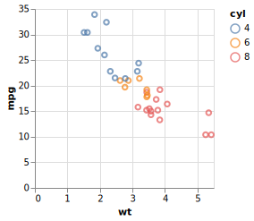
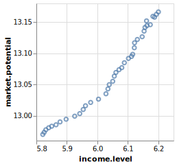

```{r, include = FALSE}
knitr::opts_chunk$set(
  collapse = TRUE,
  comment = "#>",
  dev = "svg"
)
```

For a comprehensive introduction to Vega-Lite, please visit the its [web site](https://vega.github.io/vega-lite/). 

Vega(-Lite) specifications are just text, formatted as JSON. However, in R, we can use lists to build specifications:

```r
library("vegawidget")

spec_mtcars <-
  list(
    `$schema` = vega_schema(), # specifies Vega-Lite
    description = "An mtcars example.",
    data = list(values = mtcars),
    mark = "point",
    encoding = list(
      x = list(field = "wt", type = "quantitative"),
      y = list(field = "mpg", type = "quantitative"),
      color = list(field = "cyl", type = "nominal")
    )
  ) %>% 
  as_vegaspec()
```

The `as_vegaspec()` function is used to turn the list into a *vegaspec*; many of this package's functions are built to support, and render, vegaspecs: 

```r
spec_mtcars
```



Please note that, in an effort to reduce the size of this vignette, the charts are displayed as SVG files rather than using native Vega.

This package is a low-level interface to Vega-Lite and the Vega ecosystem, which has a lot of powerful capabilities, highlighted in this series of articles:

- [Specify using vegaspec](https://vegawidget.github.io/vegawidget/articles/articles/vegaspec.html): how to construct and render a vegaspec.
- [Render using vegawidget](https://vegawidget.github.io/vegawidget/articles/articles/render-vegawidget.html): advanced rendering options.
- [Extend using Shiny](https://vegawidget.github.io/vegawidget/articles/articles/shiny.html): how to interact with Vega charts using Shiny.
- [Extend using JavaScript](https://vegawidget.github.io/vegawidget/articles/articles/javascript.html): how to interact with Vega charts using JavaScript.
- [Create Images](https://vegawidget.github.io/vegawidget/articles/articles/image.html): how to create and save PNG or SVG images.
- [Work with Dates and Times](https://vegawidget.github.io/vegawidget/articles/articles/dates-times.html): dates and times in Vega(-Lite) work a little differently from R.
- [Import into Other Packages](https://vegawidget.github.io/vegawidget/articles/articles/import.html): how to import vegawidget functions into your package, then re-export them.

To share your Vega(-Lite) creation on the [Blocks](https://bl.ocks.org) website, you can use the [**vegablock**](https://vegawidget.github.io/vegablock/) package.

## Integration with other packages

Although there is an [article](https://vegawidget.github.io/vegawidget/articles/import.html) dedicated to this aspect of the package, it warrants further emphasis. 

This package provides functions to render Vega(-Lite) specifications; although it provides some helpers, it does not provide higher-level functions to build specifications. Rather, this is left to other packages. Even though you can use its functions directly, you are invited to import and re-export them for use in *your* package. 

Accordingly, this package offers a templating function, `use_vegawidget()`, to help you integrate vegawidget functions into your package. For example, it is used to import and re-export vegawidget functions for the [altair](https://vegawidget.github.io/altair/) package.

## Known limitations

Vega(-Lite) [interprets dots in field (variable) names](https://vega.github.io/vega-lite/docs/field.html) as an indicator of nesting. 
To escape this interpretation, you can escape the dot with two backslashes, `\\`, or surround the name with square brackets, `[]`.
These escape-methods mess up the default axis-titles, so you may wish to set those manually.

For example:

```r
library("vegawidget")

list(
  `$schema` = vega_schema(), 
  data = list(values = freeny),
  mark = "point",
  encoding = list(
    x = list(
      field = "income\\.level", 
      type = "quantitative",
      scale = list(zero = FALSE),
      title = "income.level"
    ),
    y = list(
      field = "[market.potential]", 
      type = "quantitative",
      scale = list(zero = FALSE),
      title = "market.potential"
    )
  )
) %>% 
as_vegaspec()
```



There are limitations associated with vegaspecs that contain [datasets specified using remote URLs](https://vega.github.io/vega-lite/docs/data.html#url):

- The RStudio IDE may not let you access remote URLs for security reasons. A chart that accesses remote data may not render in the IDE; it *will* render in a browser window.

- The image functions use **V8** to create SVG strings. If you are accessing remote data in your chart (i.e. your spec uses an HTTP(S) URL), you will need to make sure that R has access to the remote data (i.e. if you use a proxy, it is set up in R).
 
